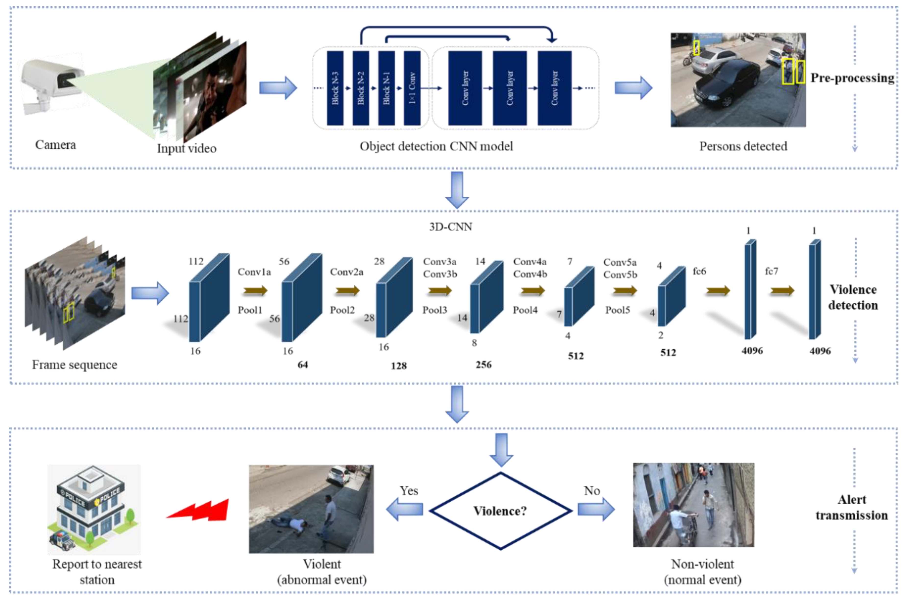

# IA-de-deteccion-de-violencia
Este proyecto implementa una red neuronal convolucional 3D (3D-CNN) para detectar escenas violentas en una transmisión de video. El 3D-CNN es un enfoque de aprendizaje supervisado profundo que aprende características violentas espaciotemporales de videos (secuencia de cuadros de imagen). A diferencia de las circunvoluciones 2D, este enfoque opera núcleos 3D en una serie de marcos de imagen en su contexto, lo que produce mapas de activación 3D que capturan características tanto espaciales como temporales que no se pueden identificar correctamente con las circunvoluciones 2D.
## Etapas del sistema

